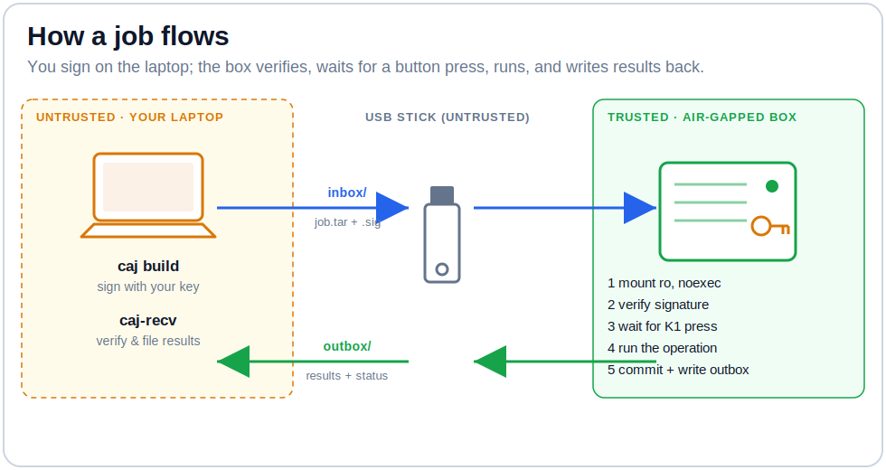
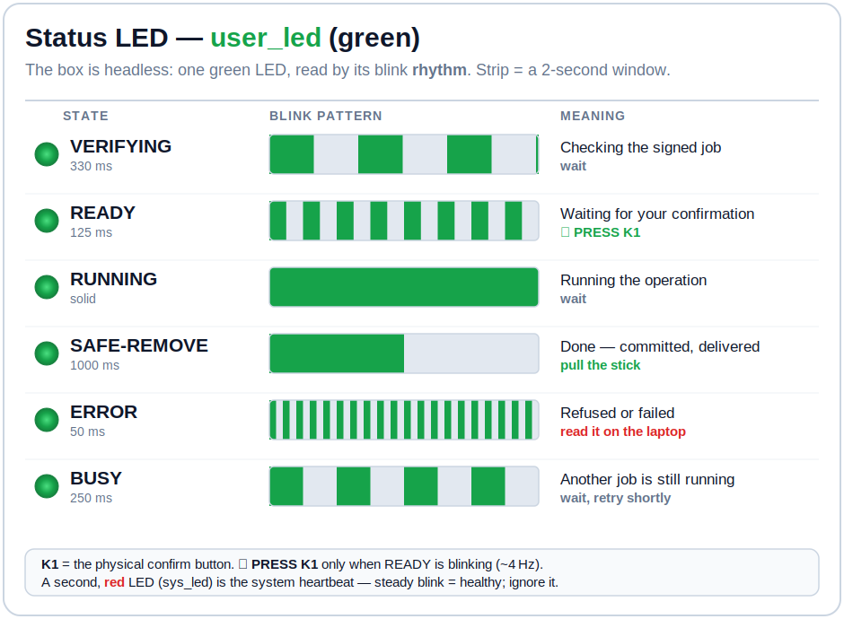

# Air-Gapped Nebula Certificate Authority — USB Job Harness

Operate a **fully air-gapped [Nebula](https://github.com/slackhq/nebula) certificate authority** — a headless box with no network, no keyboard, no monitor — using nothing but a **USB flash drive**.

You prepare a signed "job" on your online laptop, walk the stick over to the air-gapped box, press one button, and read the result back off the same stick. The CA's private key is born on the box and **never leaves it**. Every command is cryptographically signed and verified on the box before it runs.

> **Status:** Code-complete and adversarially reviewed; **685 unit tests** pass on the reference box (Debian 13 / Python 3.13). The reference build is in its pre-air-gap hardware finalization. This is a personal project shared as-is — see [Caveats](#status--caveats). Not a third-party-audited product; review it yourself before trusting it with real keys.

---

## Contents

- [Why this exists](#why-this-exists)
- [How it works in 60 seconds](#how-it-works-in-60-seconds)
- [Security model](#security-model)
- [The hardware](#the-hardware)
- [Building your own](#building-your-own)
- [Operating the CA](#operating-the-ca)
- [The operations](#the-operations)
- [Onboarding devices to the mesh](#onboarding-devices-to-the-mesh)
- [Repository layout](#repository-layout)
- [The job lifecycle in detail](#the-job-lifecycle-in-detail)
- [Testing](#testing)
- [Status & caveats](#status--caveats)

---

## Why this exists

A certificate authority is only as trustworthy as the secrecy of its signing key. The strongest protection for that key is an **air gap** — a machine that has never touched, and will never touch, a network. But an air-gapped machine is also *hard to use*: no SSH, no web UI, no remote anything. For a Nebula mesh whose CA you touch a few times a month (sign a new host, rotate a key), a full HSM ceremony is overkill and a networked CA defeats the point.

This project splits the difference. The CA runs on a **cheap, radio-free single-board computer** that is air-gapped after setup. Its *only* I/O channel is a USB stick. A small, carefully-reviewed harness on the box treats every stick as hostile, acts only on **operator-signed** jobs it verifies locally, requires a **physical button press** for every operation, and reports back through a single status **LED** and files written to the stick.

The result is a CA you can actually operate — from a laptop, over a sneakernet USB stick — that still keeps its key behind a real air gap.

---

## How it works in 60 seconds



1. **Build (laptop).** `caj build` turns a tiny job spec into a `job.tar`, then signs it with your **operator key** (`ssh-keygen -Y sign`, namespace `nebula-ca-job`). The signed bundle lands in the stick's `inbox/`.
2. **Insert (box).** A udev rule notices the vfat partition and starts a one-shot service. The box mounts the stick **read-only, `noexec`**, copies the job into a private tmpfs, and **verifies the signature there** against trust anchors stored *on the box* — never on the stick.
3. **Confirm (human).** The status LED blinks "ready"; the box waits up to 60 s for a **physical press of the K1 button**. No press, no action.
4. **Run.** The box checks freshness (monotonic sequence number, replay protection, box-identity), then runs the operation. Vetted operations run as root; an un-vetted `run-script` is dropped to an unprivileged user that *cannot read `ca.key`*.
5. **Report (box → laptop).** Results are committed on-box first (crash-atomic), then written to the stick's `outbox/`. The LED shows success or error. Back on the laptop, `caj-recv` re-verifies every output by SHA-256 and files it away.

---

## Security model

The whole design flows from one boundary: **the laptop and every USB stick are outside the trust boundary; the box is inside it.**

| Property | How it's enforced |
|---|---|
| **`ca.key` never leaves the box** | Born on-box via `ca-bootstrap` (`root:root 0400`). Every code path that touches the stick uses strict allowlists + `openat2`/`O_NOFOLLOW`, so the key cannot leak even through a planted symlink. The only key material that ever exits is an `age`-encrypted backup, encrypted to a **box-pinned** recipient a job can't redirect. |
| **Inbound commands are signed** | `inbox/job.tar` carries a detached Ed25519 `ssh-keygen` signature (SSHSIG, namespace `nebula-ca-job`), verified on-box against local `allowed_signers`. Outbound results are public self-report — integrity-checked by SHA-256 recompute, deliberately not signed. |
| **Two signer classes** | An **operational** key authorizes ordinary jobs. A separate **break-glass** key, stored offline, is required as a *co-signature* to change trust anchors or run a `run-script` as root. The installer refuses to run if the two keys are equal, and disjointness is checked as key-set intersection (immune to self-cosign tricks). |
| **Human presence is mandatory** | Every operation blocks on a live press-and-release of the physical **K1 button**, resolved by device identity (not a guessable `eventN`), with anti-tamper checks so a held-down button can't auto-confirm. |
| **Replay & monotonicity** | A `DONE`-marker commit log makes any committed job replay *identical bytes* instead of re-running; freshness demands a strictly increasing sequence number; both sides reconcile the sequence forward and never regress it. |
| **Hostile-media hardening** | `-t vfat` mount pin + `/proc/mounts` readback, `ro,noexec,nosuid,nodev`, a private per-insert mount namespace, `openat2`-confined extraction (`RESOLVE_BENEATH \| NO_SYMLINKS \| NO_XDEV`, **no fallback**), size/count/depth caps, fd-pinned symlink-safe output collection, plus optional **USBGuard** (rejects BadUSB/HID) and a filesystem-parser blacklist. |
| **Privilege separation** | Vetted operations are pre-installed, reviewed root code. Un-vetted `run-script` bytes run confined as `nebula-job` (`setpriv` uid/gid drop, scrubbed environment, PID-namespace process reaping, per-op timeout) and can only reach root with a break-glass co-signature. |

The design was hardened through two spec-time review passes and an **adversarial review of every implementation task** (each with reproduced exploits and mutation-tested defenses), which caught and fixed seven Critical-class bugs before any code reached the box — a JSON-recursion DoS, a break-glass self-cosign bypass, a `ca.key` exfil via output-symlink TOCTOU, a duplicate-cert power-loss durability gap, a Mac-side symlink exfil, a co-sign truthiness bypass (`cosigned="False"` almost ran a privileged root job), and a self-lockout in the signer-rotation path. See **[SECURITY.md](SECURITY.md)** for the full threat model and the review story.

---

## The hardware

The reference build uses a **[FriendlyELEC NanoPi NEO3 Plus](https://www.friendlyelec.com/index.php?route=product/product&product_id=299)** (Rockchip RK3528A, arm64, 1 GB RAM, eMMC). Any similar board works; what matters is:

- **Radio-free** — no Wi-Fi/Bluetooth silicon, so "air-gapped" is just "never plug in Ethernet," not "trust that the radios are off."
- **A battery-backed RTC** (the reference board has an HYM8563 + coin cell) — certificate validity windows must survive power-off, and an air-gapped box can't reach an NTP server.
- **A GPIO button** (`gpio-keys`, the "K1" user button) for the physical confirmation gate.
- **Two LEDs** — one is the kernel heartbeat (`sys_led`), the other (`user_led`) is the harness's status channel.
- **A serial console** retained as the physical break-glass rescue path after air-gap.

Flashing is standard eMMC imaging (the reference used FriendlyELEC's SD-to-eMMC Debian 13 Core eflasher image). See [Building your own](#building-your-own) for the outline; nothing about the harness is board-specific beyond the LED/button/RTC device names in `box/lib/causb/config.py`.

---

## Building your own

The full sequence (each step has a detailed operator checklist under [`tests/integration/`](tests/integration)):

1. **Flash** Debian 13 to the board; first-boot set hostname, create an admin user, install your SSH key, lock root, set the clock and `hwclock -w`.
2. **While still online**, `apt full-upgrade`, then install the checksum-verified static arm64 binaries the CA needs: `nebula-cert`/`nebula` and `age`/`age-keygen` into `/usr/local/bin`.
3. **Install the harness:** copy this repo to the box and run
   ```
   sudo box/install.sh --primary-pub <your-ed25519.pub> \
                       --breakglass-pub <breakglass.pub> \
                       --age-recipient <age-recipient>
   ```
   It's idempotent — it creates the `nebula-job` user, the state directories, the trust anchors, the audit log, and installs the `causb` package, handlers, systemd units, udev rule, and (disabled-by-default) USBGuard policy. Re-run it whenever you update the tree; **the box runs whatever `install.sh` last staged.**
4. **Keys:** your operator key is a passphrase-protected Ed25519 (upgradeable to a FIDO2/YubiKey later). Generate a **separate** break-glass keypair; its public key goes in the anchors, its private key stays offline. Pin an `age` backup recipient.
5. **Run the pre-air-gap [test gate](tests/integration)** — signed round-trip, replay, power-loss injection, blank-stick recovery, the break-glass rotation drill, the negative matrix (unsigned / wrong-key / stale / wrong-box all fail closed), and USBGuard.
6. **Air-gap last:** `sudo box/airgap.sh --confirm` masks all networking and NTP and locks the default account — but structurally **refuses** to disable the serial console (your rescue path). Then pull the cable.
7. **First post-air-gap job is `ca-bootstrap`** — `ca.key`/`ca.crt` are generated on-box and never leave.

Deployment helpers `deploy.sh` and `run-tests.sh` read your box's SSH target from a git-ignored `deploy.env` (copy `deploy.env.example`).

---

## Operating the CA

Day to day, everything is a stick round-trip:

```
# On the laptop — build + sign a job onto an inserted stick:
caj build --spec sign-web1.spec --stick /Volumes/CA-XFER

# Walk the stick to the box, insert it, watch the LED, press K1 when it blinks "ready".

# Bring the stick back, read + verify the results:
caj-recv --stick /Volumes/CA-XFER
```

A **job spec** is a few `key: value` lines plus any payload files staged next to it:

```
name: sign web1
operation: sign-hosts
payload: web1.pub
```

### Reading the LED

The box is headless, so the `user_led` *is* the UI (authoritative rhythms live in `box/lib/causb/led.py`):

| LED pattern | Meaning |
|---|---|
| Slow blink (~1.5 Hz) | Verifying the signed job |
| Fast blink (~4 Hz) | **Ready — press K1 now** |
| Solid on | Running the operation |
| Long slow pulse (1 s on/off) | Success — safe to remove the stick |
| Very fast flutter (~10 Hz) | Error — check `caj-recv` output |



*The diagram above is print-ready ([`assets/led-patterns.svg`](assets/led-patterns.svg)) — tape it to your box. A fuller LED/button cheat-sheet lives in `recovery-kit/README-OPERATOR.md`.*

### If a transfer stick is lost

Insert a **blank** stick and press K1 twice: the box writes a **recovery kit** (public docs + tooling + `ca.crt` + the trust anchors — *never* secrets) so a cold operator can rebuild `caj`/`caj-recv` from scratch. The recovery decision tree is in `recovery-kit/RECOVERY-CEREMONY.md`.

---

## The operations

| Operation | What it does |
|---|---|
| `status` | Read-only box report (CA fingerprint, sequence number, host registry, disk/RTC health). |
| `ca-bootstrap` | First-run: mint `ca.key`/`ca.crt` on-box (Nebula v1, Curve25519). Idempotent; refuses a second bootstrap. |
| `sign-hosts` | Sign one or more host certificates, assigning each a stable overlay IP from a reconcilable registry. |
| `backup-ca` | Emit an `age`-encrypted `ca.key.age` for disaster recovery, to a box-pinned recipient only. |
| `rotate-ca` | Mint a new CA, re-sign the whole fleet, emit an old+new trust bundle (and a blocklist in compromise mode). |
| `rotate-job-signers` | Replace the trust anchors (operator / break-glass keys). Break-glass changes require a co-signature. |
| `set-time` | Repair the clock (the one operation exempt from the "year ≥ 2026" sanity gate). |
| `run-script` | Run an arbitrary operator script — confined as `nebula-job`, or as root only with a break-glass co-sign. |

Overlay range, certificate lifetimes (CA 10 y, host 5 y by default), timeouts, and all size caps are constants in `box/lib/causb/config.py`.

---

## Onboarding devices to the mesh

Every device joins the mesh the same way: **its keypair is generated on the device itself** (the private key never moves), the CA signs its public key through a `sign-hosts` stick round-trip, and then the device gets `ca.crt` + its signed cert + a node config and starts Nebula. Only the last "run it as a service" step differs by OS.

### 1 — Generate the keypair *on the node*

```
nebula-cert keygen -out-key <name>.key -out-pub <name>.pub
```

The `.pub` basename becomes the host's mesh name; the `.key` stays on the node and is never copied off it.

### 2 — Sign it (one stick round-trip)

Stage the pubkey next to a spec:

```
name: sign <name>
operation: sign-hosts
payload: <name>.pub
```

`caj build --spec <spec> --stick <stick>` → carry the stick to the box → press K1 → `caj-recv --stick <stick>`. The signed `<name>.crt` is filed under `hosts/<name>/` and the registry assigns it a stable overlay IP by name.

**Sign many at once.** `payload:` is a comma-separated list (up to 16 hosts per job), so a whole batch of devices can be signed in a single round-trip:

```
payload: laptop.pub,nas.pub,phone.pub
```

### 3 — Install `ca.crt` + the cert + a config, then run it

Point each node's `config.yml` at your lighthouse(s) (`static_host_map` + `lighthouse.hosts`, `am_lighthouse: false`, no relay). A node's own overlay IP travels **in its certificate**, not the config. Then run Nebula as a boot service for the platform:

- **Linux (systemd)** — put `ca.crt`, `<name>.crt`, `<name>.key`, and `config.yml` in `/etc/nebula/`; install a `nebula.service`; `systemctl enable --now nebula`.
- **macOS (LaunchDaemon)** — keep the files in a local directory; install a root LaunchDaemon and `launchctl bootstrap system …` it. Leave `tun.dev` empty so the OS auto-assigns a `utun` device (avoids a "resource busy" crash-loop when other tunnels/VPNs are present).
- **FreeBSD / TrueNAS** — run Nebula on the host with its files on a persistent pool dataset; supervise it with `daemon(8)`; make it boot-persistent with a POST-INIT init script (on TrueNAS create it via `midclt call initshutdownscript.create`, because hand-edited rc files don't persist there). `tun.dev: nebula1` works.
- **iOS / Android** — use the Mobile Nebula app; see below.

Verify with `nebula -test`, confirm the interface comes up at the assigned IP, and check the log for handshakes with your lighthouse(s).

### Mobile devices (iOS / Android)

The [Mobile Nebula](https://github.com/DefinedNet/mobile_nebula) app generates the keypair **in the app**, so the round-trip is bookended by it:

1. In the app, add a site and **generate** the key, then copy or export its **public key**.
2. Sign that pubkey with the CA exactly like any other host (step 2 above) — including as part of a batch — producing `<name>.crt`.
3. Load the results by **scanning QR codes** in the app: on **Add Certificate → QR Code** scan the cert QR, and on the **CA** screen use **Scan QR** for the `ca.crt` QR. Then enter your lighthouse(s) and enable the site.

A Nebula certificate QR is simply the PEM text, so you can make the app-scannable QR from the already-signed cert on your online machine — no CA key required:

```
qrencode -o <name>.png < hosts/<name>/<name>.crt
```

(The CA box can equivalently emit one at signing time via `nebula-cert sign … -out-qr`; the two produce identical content.)

> **Automation note.** `caj`'s spec format passes an `args.<name>` value only as a string or bool, never a list — so the `sign-hosts` handler's per-host options (`mobile`, `groups`, and its built-in `-out-qr`) can't be set through a `caj` spec. Batch jobs therefore use the plain comma-separated `payload:` form, and you generate the mobile QR yourself with `qrencode` as shown above.

---

## Repository layout

```
box/                     Everything that runs on the air-gapped box
  lib/causb/             The harness — pure Python 3 stdlib, no dependencies
  handlers/              The vetted operations (status, ca-bootstrap, sign-hosts, ...)
  bin/ca-usb-run         The lifecycle orchestrator (mount → verify → K1 → run → deliver)
  systemd/, udev/        The insert trigger + boot-reconcile wiring
  usbguard/, modprobe.d/ Hostile-media defense-in-depth
  install.sh, airgap.sh  Provisioning + the network-sever step
mac/                     Operator tooling for the online laptop
  caj                    Build + sign a job onto a stick
  caj-recv               Verify + file the results back
tests/                   685 unit tests + on-box integration checklists
recovery-kit/            The public-only kit the box writes to a blank stick
```

Everything on the box is **Python 3 standard library only** — no third-party packages to audit or keep patched.

### Key modules (`box/lib/causb/`)

| Module | Role | Notable guarantee |
|---|---|---|
| `verify.py` | Signature check against on-box anchors | Ed25519 SSHSIG only; distinct-key enforced as key-set disjointness |
| `extract.py` | Tar → trusted tmpfs | `openat2` confinement, no unconfined fallback; refuses compressed input |
| `manifest.py` | Strict job parser | `json.loads` only; rejects bool-as-int; symmetric payload allowlist |
| `freshness.py` | Replay / monotonic-seq / box-identity | Pure read; never mutates state |
| `dispatch.py` | The single exec chokepoint | Root handlers vs confined `run-script`; strict co-sign gate |
| `collect.py` | Read untrusted output back | Fully fd-pinned, symlink/hardlink-refusing (stops `ca.key` exfil) |
| `commitlog.py` | Crash-atomic commit + boot reconcile | `DONE` marker is *the* commit point; idempotent replay |
| `button.py` | The K1 human gate | Resolves the button by identity; anti-tamper; monotonic clock |
| `led.py` | Headless status LED | Kernel-timer driven, so the pattern survives process death |
| `recovery.py` | Blank-stick recovery writer | Strict `{ca.crt, registry.json}` allowlist — never globs the CA dir |

---

## The job lifecycle in detail

`box/bin/ca-usb-run` is the state machine. It takes a global cross-instance lock (a second stick inserted mid-run just blinks BUSY and touches nothing), then:

1. **Mount** the stick `ro,noexec,nosuid,nodev` with the fstype pinned to vfat, confirmed by reading `/proc/mounts` back.
2. **Copy** the job into a 32 MB tmpfs; after this the stick is only ever *written*, never re-read.
3. **Verify** the signature against on-box anchors, capturing the signer principal. *Failure here is LED-only — nothing is extracted, no sequence number is consumed.*
4. **Extract** the now-verified tar under `openat2` confinement, then **parse** the manifest strictly.
5. **Check freshness** (box-identity, clock sanity, monotonic seq, job-id idempotency). A replay re-delivers cached bytes rather than re-running.
6. **Wait for K1** (up to 60 s). A timeout still commits (consuming the seq) so the operator can read *why* nothing happened.
7. **Dispatch** — run the handler as root, or the `run-script` confined as `nebula-job`.
8. **Commit on-box first** (`collect` the outputs symlink-safely, write `results/<job>/` + `status.json` + a fsync'd `DONE` marker). *This is the commit point.*
9. **Deliver** — remount rw, copy results to `outbox/<job>/`, write `outbox/LATEST.json` last (the reader's commit gate), `sync`.
10. **Signal** — unmount cleanly (never a lazy unmount, so "safe to remove" is truthful), then hold the success/error LED until the stick is pulled.

A boot-time reconcile service rebuilds the sequence/consumed-job caches and the host registry from the durable `DONE` markers, so an unclean shutdown can never cause a double-run or a stale replay.

---

## Testing

```
# On the box (Python 3, stdlib only):
cd /path/to/harness && PYTHONPATH=box/lib python3 -m unittest discover -s tests/unit -v

# From the laptop (deploys to the box first; needs deploy.env):
./run-tests.sh
```

**685 unit tests** cover every module and handler, driving the real `verify`/`extract`(openat2)/`manifest`/`freshness`/`collect`/`commitlog` against genuinely `ssh-keygen`-signed tars — mocking only the physically un-testable edges (the mount, the button, the LED). The `tests/integration/` directory holds root-on-box scripts (real `setpriv` uid-drop, real loopback vfat mounts, real evdev) plus operator checklists for the physical confirmations a unit test can't stand in for.

---

## Status & caveats

- **This is a personal project, shared as-is.** It has not been through a third-party security audit. The internal adversarial review was thorough, but you should read the code and threat model yourself before trusting it with keys you care about.
- **It is board- and workflow-opinionated.** Device names, paths, and the exact hardware live in `box/lib/causb/config.py` and the systemd/udev files; adapt them to your board.
- **The reference build is still in pre-air-gap finalization** — the code is complete and tested, but the physical test-gate + air-gap ceremony are the last mile.
- **Cryptography is standard and boring on purpose:** Ed25519 SSH signatures via `ssh-keygen`, `age` for backup encryption, Nebula's own `nebula-cert`. No hand-rolled crypto.

---

*Built with [Nebula](https://github.com/slackhq/nebula) · signatures via OpenSSH · backups via [age](https://github.com/FiloSottile/age).*
