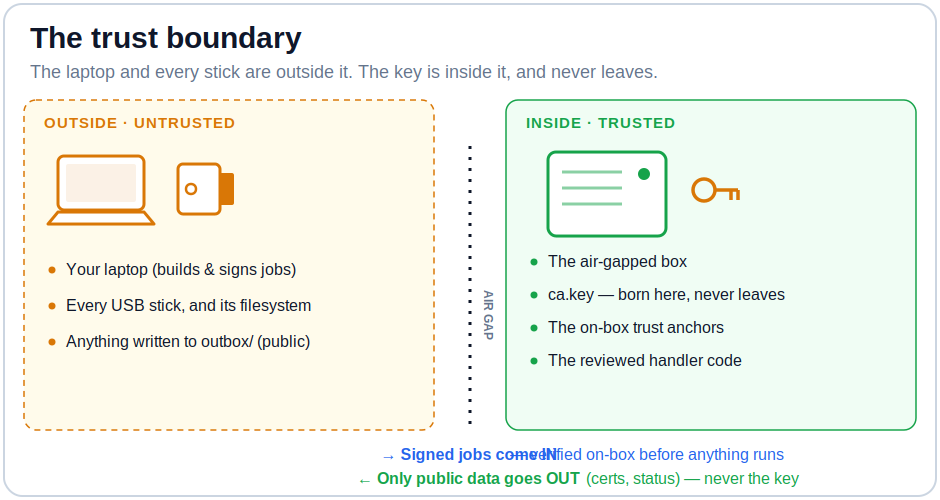

# Security Model & Threat Model

This document explains what this system defends against, how, and where the trust boundaries lie. It complements the overview in the [README](README.md).

The design premise: **a CA private key is best protected by an air gap, but an air-gapped box is useless if you can't operate it safely.** Every decision below follows from making a USB stick the *only* I/O channel while assuming that stick — and the laptop that wrote it — are hostile.

---

## Trust boundary

The box assumes the stick can contain **anything**: a malformed filesystem, a decompression bomb, symlinks and hardlinks aimed at `ca.key`, a forged or replayed job, a BadUSB device pretending to be storage, or a perfectly valid job from someone who stole a laptop. It treats a signed job from a known operator as authorized — and treats *everything else* as an attack to fail closed on.

---

## Assets, ranked

1. **`ca.key`** — the CA signing key. Compromise = forge any identity in the mesh. Defended structurally: born on-box (`ca-bootstrap`), stored `root:root 0400`, and **every path that touches a stick uses an allowlist**, never a filter, so there is no code that *could* copy it out even if asked. The only key material that ever leaves is an `age`-encrypted backup to a box-pinned recipient.
2. **The trust anchors** (`allowed_signers`, `breakglass_signers`) — whoever these name can command the box. Changing them is the most privileged operation and requires a break-glass co-signature.
3. **Availability / correctness** — a wedged box, a double-signed cert after a power loss, or a stale replay are all failures. Defended by the crash-atomic commit log and boot reconcile.

---

## What an attacker can do (capabilities assumed)

| The attacker can… | …and the box responds with |
|---|---|
| Hand the box an arbitrary USB device | USBGuard rejects non-storage/HID (BadUSB); udev only acts on a vfat partition |
| Put a malformed/exotic filesystem on the stick | Mount is pinned `-t vfat` (never auto-probed) `ro,noexec,nosuid,nodev`, confirmed via `/proc/mounts`; non-vfat parsers are modprobe-blacklisted |
| Put a decompression bomb or a huge tar on it | Extractor refuses compressed input (`r:` only) and enforces byte/file/depth caps *before* reading |
| Put symlinks/hardlinks/device nodes in the tar, aimed at `ca.key` | `openat2(RESOLVE_BENEATH\|NO_SYMLINKS\|NO_XDEV)` on extract, and fd-pinned `O_NOFOLLOW`+`S_ISREG`+`st_nlink==1` on output collection — no path can escape the job directory |
| Forge or tamper with a job | Detached Ed25519 SSH signature verified on-box against local anchors; any failure is fail-closed and LED-only |
| Replay a previously valid job | Monotonic sequence number + job-id commit log; a replay re-delivers cached bytes, never re-runs |
| Steal a laptop (and the operator key) | Still can't change trust anchors or get root without the **separate, offline break-glass key**; still needs physical access to press K1 |
| Insert a stick while another job runs | Global flock — the second insert blinks BUSY and touches no state |
| Yank power mid-operation | `DONE`-marker commit is the atomic point; boot reconcile rebuilds caches from durable markers; no double-run, no stale replay |
| Submit an un-vetted script to run | Dropped to `nebula-job` (uid drop, scrubbed env, PID-ns reap, timeout); cannot read `ca.key`; root requires break-glass co-sign |

What the box **cannot** defend against, by construction: an attacker who both (a) holds a valid signing key and (b) has physical access to press the button. That is the operator. Protect the keys and the box accordingly.

---

## Directionality: signed in, public out

- **Inbound (commands)** are authenticated. `inbox/job.tar` carries a detached `ssh-keygen` SSHSIG signature (namespace `nebula-ca-job`) verified against `allowed_signers` *stored on the box*, never trusting anything on the stick.
- **Outbound (results)** are **not signed** — they are public self-report (certs, a host registry, status JSON). They are integrity-checked: `caj-recv` recomputes the SHA-256 of every declared output from the same file descriptor it copies, refusing symlinks, before placing anything. There is nothing secret to protect on the way out, so a signature would add key-management burden for no gain.

---

## The two signer classes

The installer provisions two disjoint trust anchors and **refuses to install if they are the same key**:

- **Operational** (`allowed_signers`, principal `nebula-ca-operator`) — authorizes ordinary jobs on its own: `status`, `sign-hosts`, `backup-ca`, an unprivileged `run-script`, etc.
- **Break-glass** (`breakglass_signers`, principal `nebula-ca-breakglass`) — stored offline, physically separate. Required as a **co-signature** for the dangerous operations: any change to `breakglass_signers`, or a `run-script` requesting `privileged` root execution.

Disjointness is enforced as **key-set intersection**, not string comparison — so a single file listing multiple principals can't be used to "co-sign itself." A break-glass signature *alone* (presented in the primary slot) is accepted for exactly one thing: `rotate-job-signers` changing **only** `allowed_signers` — the recovery path for a lost operator key, still gated on K1, freshness, and box-identity.

Privilege flags cross into handlers as `is True`-strict booleans; a truthy *string* (`"true"`, `"1"`) is never accepted — a lesson from a real caught bug where `cosigned="False"` (a non-empty, truthy string) nearly ran a privileged root job.

---

## Defense in depth: the layers

1. **Device layer** — USBGuard policy (allow the known stick + generic storage; reject HID and BadUSB composites), `usbcore` fs-parser blacklist.
2. **Mount layer** — vfat pin + readback, `ro,noexec,nosuid,nodev`, private per-insert mount namespace.
3. **Parse layer** — signature verify *before* extraction; `openat2`-confined extraction with no fallback; strict `json.loads` manifest parsing with symmetric payload allowlist.
4. **Authorization layer** — freshness/replay/box-identity checks; the physical K1 gate; the signer-class + co-sign rules.
5. **Execution layer** — vetted handlers as root; un-vetted scripts confined to `nebula-job` with a scrubbed environment and PID-namespace reaping.
6. **Output layer** — fd-pinned, symlink/hardlink-refusing collection; strict allowlist recovery-kit writer; crash-atomic commit before any delivery.
7. **Recovery layer** — boot reconcile; a serial console `airgap.sh` structurally refuses to disable; `rotate-ca` that never leaves the box keyless.

Each layer assumes the ones outside it may have failed.

---

## The hardening review story

Every implementation task was built test-first and then **adversarially reviewed on the box**, with the reviewer reproducing the exploit and mutation-testing the fix. That process caught **seven Critical-class bugs** before any code reached an air-gapped box:

1. A **JSON-recursion DoS** in manifest parsing.
2. A **break-glass self-cosign bypass** (multi-line principals treated as distinct signers).
3. A **`ca.key` exfil** via an output-symlink TOCTOU in collection.
4. A **duplicate-certificate power-loss** durability gap.
5. A **Mac-side symlink exfil** in `caj-recv` against a hostile `--stick`.
6. A **co-sign truthiness bypass** (`cosigned="False"` ran as truthy).
7. A **silent self-lockout** in `rotate-job-signers` (an anchor file with valid *syntax* but invalid *key material* installed successfully, then couldn't be loaded — bricking the box past the empty-file guard).

Whole-branch reviews additionally caught controls that were *built but never wired* — an audit log the orchestrator forgot to feed, a boot-reconcile function no unit invoked, and a recovery doc that promised a path the code refuses. **The lesson, if you rebuild this:** the subtle bugs live in the pre-authentication layers, the filesystem/TOCTOU edges, `bool`-vs-truthy gates, key-material validation, and the *cross-component seams* a per-file review can't see.

---

## Cryptographic primitives

Deliberately standard and boring — no hand-rolled crypto:

- **Job signatures:** Ed25519 via OpenSSH `ssh-keygen -Y sign`/`-Y verify` (SSHSIG), namespace-bound to `nebula-ca-job`.
- **Certificates:** Nebula's own `nebula-cert` (Curve25519, format version 1).
- **Backup encryption:** [`age`](https://github.com/FiloSottile/age), to a box-pinned recipient.

---

## Reporting

This is a personal project shared as-is, not a maintained product with a security SLA. If you find a flaw and want to share it, please open an issue describing the problem and its impact. Do not include working key material or exploit payloads that target a live box.
